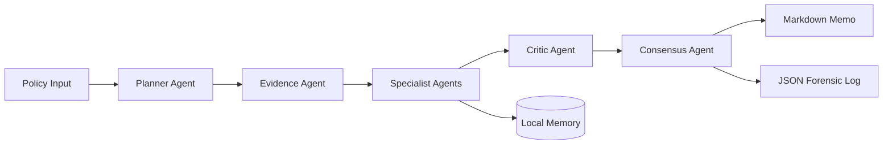

# Government Policy Agent

An evidence-driven multi-agent analyst for government policy, regulation, public programs, budgets, implementation risk, and stakeholder impact.

The system accepts a policy topic or text, routes it through specialist agents, runs a critic pass, builds a directional consensus, and writes a Markdown policy memo plus JSON forensic log.

## Architecture



## Agents

- Planner Agent: domain classification, routing, key questions
- Evidence Agent: source metadata and text ingestion
- Legal Policy Agent: authority, compliance, rights, process
- Fiscal Impact Agent: cost, revenue, funding, sensitivity
- Implementation Agent: feasibility, capacity, sequencing
- Stakeholder Agent: citizen, business, state, NGO, vulnerable group impact
- Geopolitical Agent: trade, sanctions, treaty, diplomatic exposure
- Risk Assessment Agent: political, legal, operational, reputational, social risk
- Critic Agent: unsupported claims, missing evidence, conflicts
- Consensus Agent: Support, Modify, Delay, Reject with confidence score

## Setup

```bash
python -m venv .venv
source .venv/bin/activate
pip install -r requirements.txt
cp .env.example .env
python scripts/init_db.py
```

On Windows PowerShell:

```powershell
python -m venv .venv
.venv\Scripts\Activate.ps1
pip install -r requirements.txt
copy .env.example .env
python scripts/init_db.py
```

## Run Backend

```bash
uvicorn app.main:app --reload
```

Open the API docs at `http://127.0.0.1:8000/docs`.

## Run Frontend

```bash
streamlit run frontend/streamlit_app.py
```

The Streamlit app can run directly through local Python or call the FastAPI backend.

## Run Sample

```bash
python scripts/run_sample.py
```

Generated reports are saved in `app/data/reports/`.

## API Example

```bash
curl -X POST http://127.0.0.1:8000/analyze \
  -H "Content-Type: application/json" \
  -d '{
    "title": "Digital Personal Data Protection Rules",
    "jurisdiction": "India",
    "policy_text": "Paste policy text here",
    "urls": ["https://example.gov/policy"],
    "analysis_depth": "standard"
  }'
```

## Environment Variables

```text
LLM_PROVIDER=mock
MODEL_NAME=mock-policy-analyst
OPENAI_API_KEY=
DATABASE_URL=sqlite:///./policy_agent.db
REPORTS_DIR=app/data/reports
MEMORY_DIR=app/data/memory
```

The app runs without an API key using deterministic local mock analysis. Add a real provider later in `app/services/llm_client.py`.

## Tests

```bash
pytest
```

## Push To GitHub

```bash
git init
git add .
git commit -m "Initial government policy agent"
git branch -M main
git remote add origin https://github.com/YOUR_USERNAME/government-policy-agent.git
git push -u origin main
```

## Notes

This project is a decision-support tool, not legal advice. Policy outputs should be reviewed by qualified domain experts before publication or operational use.

